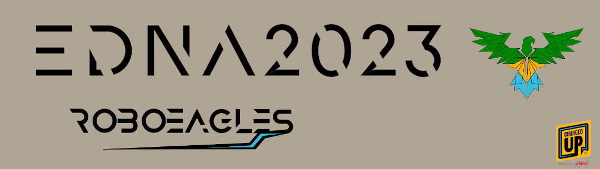

# Requirements
- Ubuntu 22.04
- [Visual Studio Code](https://code.visualstudio.com/)
- RTX Enabled NVIDIA GPU
- (Optional) An Xbox controller

# Installation

### 1. Install Graphics Drivers
Simply run `sudo apt-get install nvidia-driver-525` in order to install the NVIDIA graphics driver for Ubuntu!

### 2. Local Setup
- **Install Docker and Nvidia Docker**  
Running `./scripts/local-setup.sh` should install the requirements for this repository to run! At some point during running, it may prompt you for a `ROS_NAMESPACE`, which you can read more about [here](https://docs.ros.org/en/foxy/Tutorials/Intermediate/Launch/Using-ROS2-Launch-For-Large-Projects.html#namespaces). Make sure to restart your machine once the script is done running!

- **Install Remote Development VS Code Extension**  
This repository requires the [Remote Development](https://marketplace.visualstudio.com/items?itemName=ms-vscode-remote.vscode-remote-extensionpack) extension pack. Make sure to install it in the VSCode extensions window!

- **Reopen in Devcontainer**  
Once installed, you can open the command pallate by pressing <kbd>F1</kbd>, and running the command `Reopen in Container` in order to open the devcontainer. This might take a while, but once it's finished you should see a message appear in a console stating some helpful commands, along with a list of connected controllers and your `ROS_NAMESPACE` which you set up earlier.

### 3. (Optional) ROS Setup
For the robot to run correctly, both in the simulation and in the real world, we use ROS2 in order to communicate between all of the parts of our project!
- **Building the project**  
The entire project is built as a colcon task, so you can run it by pressing <kbd>Ctrl</kbd>+<kbd>Shift</kbd>+<kbd>B</kbd> in VSCode, or by running `colcon build --symlink-install` in order to build all of the ROS2 packages.

To confirm that this worked, you can simply open a new terminal, and the warning message reminding you to build should be gone!

# Running the Robot

<b style="font-size:1.5em">In the simulation</b>

### 1. (Optional) Installing Omniverse Server
Omniverse is a NVIDIA product which allows for programs to cache their information quickly and reliably. It's not needed, but can save a lot on load times!
- **Download Omniverse Launcher**  
https://www.nvidia.com/en-us/omniverse/download/

- **Run Omniverse**  
`chmod +x omniverse-launcher-linux.AppImage`  
`./omniverse-launcher-linux.AppImage`

- **Install Cache and Nucleus Server**
Click on the "Exchange" tab, and search for "Cache", which should return only one result. Nucleus Server should already be installing by default. Wait until both are downloaded and installed before continuing.

### 2. Isaac Container Setup
- **Create Shaders**  
Isaac uses RTX heavily in order to accurately render graphics, which takes some powerful shaders. In order to get Isaac to build the shaders, run `isaac-setup` inside the devcontainer in order to start compilation of shaders.
- **Launch Isaac**  
In order to actually start the simulation, just run the command `isaac` inside the devcontainer in order to start Isaac. It might take a while on first launch, but you should see the simulation window pop up eventually.
- **Load the robot**  
As you should be able to see, there's currently nothing *in* Isaac. It should be showing an empty scene with a popup window to the top left labeled "Import URDF" with a button that says "Load". If you press it, you should see the 2023 playing field appear, along with a brightly colored robot in the center!

### 3. Start the simulation
- **Start Isaac**  
Inside of Isaac, you should see a bar with a play button to the left. Click on it, or press <kbd>Space</kbd> in order to start the simulation. If everything works correctly, you should see the robot fall to the ground and be ready for movement!
- **Start the ROS2 Control Node**  
In order to get the robot to move around, you're going to need to plug in a controller and start the control node, something that you can do easily by running `launch isaac` inside the devcontainer.

If all goes well, you'll be able to move the robot around with the joystick! See [Controls]() for more details on how to drive the robot.

<b style="font-size:1em">Simulating the RoboRIO</b>

The National Instruments [RoboRIO](https://www.ni.com/en-us/shop/model/roborio.html) is a required computer for the FRC competitions, and as such, all of our code to physically move robot parts has to be run through it.

In order to run this simulator, you'll have to navigate to the `rio/` before running the following commands.

- **Installing RobotPy**  
First, run `pip install -r requirements.txt` in order to install robotpy and the other dependencies that the simulator needs.
- **Running the sim**  
Once you have the dependencies installed, all you'll have to do is run `python3 robot.py sim` to open the RoboRIO simulator.

To read more on the simulator, check out their docs [here](https://robotpy.readthedocs.io/en/stable/guide/simulator.html)!

<b style="font-size:1.5em">In real life</b>

### 1. Setting up the robot
If you want to actually set up the robot, check out [Setting up the Robot]() in order to get the onboard coprocessor running.

However, for debugging purposes, sometimes its easier to bypass this.

- **Running the Robot**  
To run the robot code, make sure you're connected to your robots' network, and run the command `launch real` inside the devcontianer in order to start the robot code.

In order to debug and visualize the robot remotely, we use [rviz](https://github.com/ros2/rviz) in order to view joint poses and other ROS information published from the robot.

- **Starting rviz**  
Luckily, we have another quick launch in order to start a preconfigured rviz, so you can simply open a new terminal (separate from the one running `launch real`), and run `launch rviz`. This should open up a new rviz window with the robot inside. You may need to change some of the namespaces in the window, as when running the real robot, the namespace will switch to be `real` instead of whatever you entered in the setup script.

### 2. Driving the Robot
When it comes to driving the robot, you'll need a Driver Station, which we have two separate options to use.
- **NI Driver Station**  
In order to run your robot during the competition, you'll need the official National Instruments Driver Station, with all alternatives being disallowed during competitions. For this, you're going to have to have a separate computer running Windows in order to install the [FRC Game Tools](https://www.ni.com/en-us/support/downloads/drivers/download.frc-game-tools.html), which installs the Driver Station as a part of it.
- **Conductor**  
Despite the National Instruments driver station being the only officially supported Driver, there are some community made alternatives that you can use! We recommend using [Conductor](https://github.com/Redrield/Conductor), as it's one of the most feature complete community alternatives out there, and runs fully on linux, meaning that you don't need a separate computer, and you can run everything on just one computer!

Once you have a driver station setup, you should be able to enable teleop mode with an Xbox controller connected, and the robot should move when you move the joystick! See [Controls]() for more details on how to drive the robot.

<b style="font-size:1.5em">Debugging the robot</b>

In order to debug the robot, we built our own debugger in Python and PyQT!

### 1. Launching the debugger  
Simply run `launch rio-debug` in order to open the debugger!

### 2. Using the debugger
- **Reading in published joint states**  
The joint states that are published from the robot to your computer are represented by the slider bars and buttons. Buttons are a togglable state where the output should be one of two values, whereas the sliders are joints where the output should be one of a range of values, usually used for wheels or other motors.  
You can tell the current joint state from the robot by looking at the top slider bar, as it will reflect the actual position of the joint on the robot. For the buttons, the color of the button represents the stater of the joint, with green meaning that the state from the robot is the same as the current state from your computer, and yellow meaning that they are not the same.  
You can also tell the states of the joints based on the boxes to the left of them, which should contain the exact numbers recieved from ROS.
- **Publishing out your own joint commands**  
To publish out your own joint commands, simply use the bottom slider, or click on the buttons in order to edit the joint state being broadcast out to the robot!

# Setting up your own robot
> An incredibly difficult task which we've only done once or twice. This documentation is currently untested! Here be dragons!
## Requirements
- A National Instruments RoboRIO
- An NVIDIA Jetson Xavier
- A lot of patience

## Setting up the RoboRIO
Because of how our repository is built on the [RobotPy](https://robotpy.readthedocs.io/) framework, you're going to need to install RobotPy.

> Important Note: You'll have to follow these steps on your **host machine**, as there's currently a bug where RobotPy's deployment script does not work inside of the devcontainer.

### 1. Installing RobotPy
Installing robotpy is as simple as navigating to the `rio/` directory and running `pip install -r requirements.txt` in order to install the dependencies of robotpy.

### 2. Installing RobotPy onto the RoboRIO
Unfortunately, this step is somewhat outside of the scope of this tutorial. We recommend you follow RobotPy's [official setup guide](https://robotpy.readthedocs.io/en/stable/install/robot.html) for installing `robotpy-installer` and getting python onto the RIO.

However, there is one thing not covered by the tutorial. You will have to run `robotpy-installer download [package]` and `robotpy-installer install [package]` for the `wpilib` and `rosbags` packages respectively.

### 3. Deploying to the RoboRIO  
To deploy to the RoboRIO, you'll need to connect your computer to the RIO, either over USB or over the network. Once you're connected you can run `python3 robot.py deploy` in order to flash the script onto the RoboRIO.

## Setting up the Jetson
The Jetson acts as the coprocessor for the RoboRIO, as the RIO doesn't have nearly enough processing power in order to run complex AI models or vision processing algorithms.

> WARNING: This part was written by the person who DID NOT setup up the Jetson. Please fact check it for accuracy before pushing to main!

### 1. Installing the repository
Installing the repository follows essentially the same steps as our setup guide, just with more raw docker commands than the nice setup that VSCode does for you.